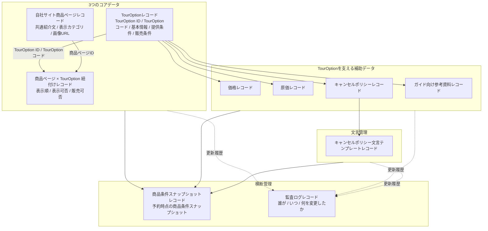

# 商品・販売設計 資料（修正版）

## 1. この資料の目的

この資料は、DeepExperienceの新システムにおける「商品・販売設計」の基本方針、データ構造、管理画面、初期MVP範囲、将来拡張方針を整理するための資料です。

初期MVPだけを定義する資料ではなく、今後の更新で最終版・拡張版の設計も追記していく親資料として扱います。  
そのため、本資料内で「初期MVP」と書く場合は、商品・販売設計全体のうち、初期リリースで優先して実装・運用確認する範囲を指します。

ここでいうMVPは、単独の小さな機能ではなく、**商品を作成し、自社サイトで販売できる状態にするために、初期リリース時点で最低限そろえるべき業務・データ・管理機能のまとまり**を指します。

つまり、「商品情報」「販売条件」「価格・原価」などを個別に見るのではなく、これらがそろって初めて、商品・販売設計としての初期MVPが成立する、という考え方です。

---

## 2. 初期MVPの基本方針

### 2-1. 初期MVPで実現したいこと

初期MVPでは、以下を実現できる状態を目指します。

* ツアー商品を社内で一元管理できる
* 商品を「TourOption」単位で整理できる
* TourOptionを日付を持たない商品定義として管理できる
* 自社サイトの商品ページに、販売するTourOptionを紐付けられる
* キャンペーンLPなど、通常の商品ページとは異なるページにもOptionを紐付けられる構造にする（将来的に可能な構造に）
* 最低限の販売条件を設定できる
* 価格・原価をTourOptionごとに設定できる（初期では数値フィールドレベル）
* キャンセルポリシーをTourOptionごとに設定できる
* 公開前チェックにより、販売可能な状態か確認できる
* 予約が入った時点の商品条件スナップショットを紐付けられる
* 運営・ガイド向けに必要な提供情報を管理できる
* 将来的にBokun・OTA・自社サイトとの連携に拡張しやすい構造にする

### 2-2. 初期MVPでやりすぎないこと

初期MVPでは、以下は原則として対象外、または簡易対応とします。

* OTAごとの詳細な商品ページ編集
* OTAごとの完全な価格・在庫・コンテンツ同期
* 複雑なチャネル別販売ルール
* 日程別のリソース・催行回の高度な制御
* SEO / OGPなどの詳細な集客最適化項目
* すべてのBokun項目・OTA項目の完全再現
* 高度な承認ワークフロー
* 差分比較・復元まで含む完全なバージョン管理
* AIによる商品自動生成・自動改善

ただし、将来拡張できるように、データ構造としては拡張余地を残します。

### 2-3. ページごとの見せ方変更：将来フェーズの方針

Phase 1では、同じTourOptionを複数のページに紐付けた場合、全ページで同じ表示内容を使う。

ページごとに見せ方を変えたい場合の実装方針は、将来フェーズで別途設計する。  
上書き方式（紐付けレコードにページ固有フィールドを持つ方式）は採用しない。

### 2-4. 将来版・最終版の扱い

本資料では、初期MVPで実装する範囲だけでなく、将来版・最終版で追加する可能性がある設計も追記していきます。  
初期MVPに含める項目と、将来拡張として残す項目は、各章で明示します。

---

## 3. 商品・販売設計の全体像

商品・販売設計は、以下の構成で整理します。  
初期MVPでの位置づけは、最初に実装・運用確認する優先度を示します。

| 区分 | 役割 | 初期MVPでの位置づけ | タスク優先 |
| --- | --- | --- | --- |
| 商品情報 | TourOption・商品ページの基本情報を管理する | 必須 | [TourOptionと商品概念の実装](https://www.notion.so/TourOption-35d64986056080d98f32d88eab6b5781?pvs=21) |
| 販売条件 | 予約条件・人数条件・キャンセル条件などを管理する | 必須 | [TourOptionと商品概念の実装](https://www.notion.so/TourOption-35d64986056080d98f32d88eab6b5781?pvs=21) |
| キャンセルポリシー文言テンプレート | キャンセル条件を表示文に展開する文言テンプレートを管理する | 必須 | [キャンセルポリシー文言テンプレート機能](https://www.notion.so/35d64986056080bda98dd1e29822e06a?pvs=21) |
| 価格・原価 | 販売価格、価格単位、原価、ガイド経費などを確認・管理する | 優先度低い | [TourOptionと商品概念の実装](https://www.notion.so/TourOption-35d64986056080d98f32d88eab6b5781?pvs=21)<br>MVPは価格はOptionのInputでOK |
| 掲載管理 | 自社サイトの商品ページとOptionの紐付けを管理する | 必須 | [TourOptionと商品概念の実装](https://www.notion.so/TourOption-35d64986056080d98f32d88eab6b5781?pvs=21) |
| 公開前チェック | 販売開始に必要な情報がそろっているか確認する | 必須 | [公開前チェック機能](https://www.notion.so/35d64986056080d38f77cdf8cd2c9e0a?pvs=21) |
| 商品条件スナップショット | 予約時点の商品条件を後から確認できるようにする | 必須 | 予約機能のあとか同時に。 |
| ガイド向け参考資料・注意事項  | 担当ガイドが事前に読む参考資料・注意事項を管理する | 必須 | [ガイド向け参考資料](https://www.notion.so/35d64986056080e9b733d524c5b50f0c?pvs=21)<br>基本資料やツアー固有の情報など複数のLink集的なイメージ |
| 監査ログ | 更新者・更新日・変更理由を管理する | MVP後 | [監査ログ](https://www.notion.so/35d64986056080f09073d46613213fed?pvs=21) |
| チャネル連携 | Bokun・OTAとの接続を見据えた管理項目を持つ | 初期は限定対応 | [チャネル連携](https://www.notion.so/35d64986056080d3be18cc4e4055245b?pvs=21) |

---

## 4. データ構造の基本方針

### 4-0. この設計で守りたいこと

TourOptionと商品ページの関係を設計するにあたり、以下の3つを最優先原則とします。

1. **販売チャネル（ページ）を増やしやすい**：同じツアーを通常ページ・キャンペーンLP・特集ページなど複数の文脈に展開するとき、リソース・催行条件の管理が複雑にならない
2. **リソースの二重管理が起きない**：どのページから予約が入ってもリソースは一元管理され、二重販売やリソースのズレが起きない
3. **チャネル別（ページ別）の分析が自然にできる**：どのページ経由で何件売れたかが、追加の集計ロジックなしに構造として取れる

将来フェーズでページごとの見せ方変更やチャネル拡張を設計する際も、この3原則を満たしているかを判断基準とします。

初期MVPでは、商品管理のデータ構造を以下の **3つのコアデータ + 7つの補助データ** で整理します。

本資料では、DBや業務データ上の単位を `レコード` と呼び、画面上で複数件を並べて表示する機能を `一覧表示` と呼び分けます。  
たとえば `TourOptionレコード` は1つの販売・催行単位を表し、`TourOption一覧表示` は複数のTourOptionレコードを画面上に並べる機能を指します。

### 4-1. コアデータ

| レコード | 目的 | 主な内容 |
| --- | --- | --- |
| TourOptionレコード | 実際に販売・催行される選択肢と、選択後に表示する標準詳細を管理する | テーマタイトル、TourOption名、TourOption選択表示名、短い説明、所要時間、人数条件、集合場所、提供条件など |
| 自社サイト商品ページレコード | 自社サイト上の商品ページと、紐付くTourOption群に共通する見せ方を管理する | ページ名、URL、ページ表示カテゴリ、ページ表示エリア、共通紹介文、メイン画像、掲載ステータス、ページ種別など |
| 商品ページ × TourOption 紐付けレコード（中間テーブル） | どの商品ページでどのTourOptionをどう表示・販売するか管理する | 商品ページID、TourOption ID、TourOptionコード、表示順、表示可否、販売可否（Phase 1）／ページ固有カスタマイズは将来フェーズで設計 |

### 4-2. 補助データ

| レコード | 目的 | 主な内容 |
| --- | --- | --- |
| 価格レコード（初期はなし） | TourOption ID / TourOptionコードごとの販売価格・価格単位を管理する | 大人/子供、年齢条件、1名あたり/1組あたり、税込/税抜、通貨など |
| 原価レコード（初期はなし） | TourOption ID / TourOptionコードごとの原価やガイド経費を管理する | 施設費、交通費、飲食費補助、その他経費など |
| キャンセルポリシーレコード | キャンセル条件そのものを管理する | 無料キャンセル期限、キャンセル料率、返金不可条件、文言テンプレートなど |
| キャンセルポリシー文言テンプレートレコード | キャンセル条件を表示文に展開する文言テンプレートを管理する | テンプレート名、本文、利用変数、言語など |
| 商品条件スナップショットレコード（予約ログのような形で実現） | 予約時点の商品条件スナップショットを保持する | 商品条件スナップショットID、予約ID、対象TourOption ID、対象TourOptionコード、商品ページID、商品ページ × TourOption 紐付けID、予約作成日時、商品条件スナップショットなど |
| ガイド向け参考資料レコード | 担当ガイド向けに用意する事前資料を管理する | 参考URL、資料名、資料種別、案内ポイント、注意点など |
| 監査ログレコード | 商品情報の更新履歴を管理する | 更新者、更新日、変更対象、変更理由など |
| チャネル別掲載URLレコード | TourOption × チャネルごとの掲載URLを管理する | TourOption ID/コード、チャネルID/チャネル名、掲載URL |



### 4-3. 基本的な親子関係

初期MVPでは、以下の関係を前提とします。

* 初期MVPでは、TourOptionの上位に独立した商品マスターは持たない
* 1つの商品ページには、複数のTourOptionを紐付けられる
* 1つのTourOptionは、複数の商品ページに紐付けられる

キャンペーンLPや特集ページでTourOptionをまとめる場合は、商品ページの一種または別種の掲載ページとして管理します。

---

## 5. 商品情報

### 5-1. 商品情報の目的

商品情報の目的は、ツアー商品を社内で管理し、自社サイトや外部販売チャネルに展開できる基本データを整えることです。

ここで重要なのは、「商品ページ」と「Option」を分けて考えることです。

* **商品ページ**：お客様に見せる販売ページ
* **TourOption**：実際に販売・催行される、日付を持たない商品定義

TourOptionは「浅草フードツアー 3時間プラン」のような販売メニューを表します。  
「2026年5月1日 10:00開始」のような日程別の催行回・リソース管理は、商品・販売設計の対象ではなく、リソース管理・催行回設計側で扱います。

TourOptionの上位に独立した「商品」マスターは持ちません。  
企画上のまとまりや顧客向けの見せ方は、自社サイト商品ページ、キャンペーンLP、特集ページなどの掲載ページで表現し、実際に販売・催行される単位はTourOptionとして管理します。

### 5-2. 初期MVPで管理すべき主な項目

#### TourOptionレコード

TourOptionは、実際に予約・販売・催行される単位です。  
KlookやKKdayのように、商品ページ上でTourOptionを選択した後に表示される詳細情報の標準値もTourOption側で管理します。Phase 1では全ページで同じ表示内容を使う。ページごとの見せ方の変更は将来フェーズで設計する。

* TourOption ID（システム側で自動生成する内部ID）
* TourOptionコード（業務上の不変コード。原価表上の商品コードとしても扱う）
* テーマタイトル
* TourOption名
* 正式名称
* TourOption選択表示名（商品ページのTourOption選択UIに出す標準名）
* TourOption短い説明（選択UIや詳細パネルで使う標準説明）
* TourOption詳細説明（選択後に表示する標準説明）
* TourOptionタグ / バッジ（例：午前発、貸切、人気など）
* TourOption代表画像URL（TourOption固有画像がある場合）
* TourOption画像ギャラリーURL一覧（TourOption固有画像がある場合）
* 商品種類
* カテゴリ
* 都道府県
* 市区町村
* エリア名（Phase 1は都道府県または都道府県内の主要都市。将来フェーズでマーケティング観点のエリア粒度に分離予定）
* 商品コンセプト
* 所要時間
* 所要時間の単位
* 1予約あたりの最小人数
* 1予約あたりの最大人数
* 1催行回あたりの最小人数（＝最少催行人数）
* 1催行回あたりの最大人数 / 定員
* 集合場所
* 集合場所英語名
* Google Map URL
* ピックアップ有無
* 解散場所
* ゲスト向けスケジュール（商品ページ表示用の行程概要）
* Inclusions
* Exclusions
* 基本キャンセルポリシーID
* 予約期限（カットオフ）
* ガイド向け注意事項
* ガイド向け参考資料有無
* 主なガイド向け参考資料リンク
* ガイド向け参考資料メモ
* 営業時間・定休日に関するメモ
* 施設予約必要有無
* 販売ステータス
* 販売停止理由
* 販売停止メモ
* 販売再開予定日
* 販売終了日

#### TourOption IDとTourOptionコードの扱い

初期MVPから、システム側で自動生成する `TourOption ID` と、業務上の不変コードである `TourOptionコード` の両方を持ちます。

TourOption IDは、システム内部の主キーとして扱います。  
商品ページ × TourOption紐付け、価格、原価、キャンセルポリシー、商品条件スナップショット、予約など、システム内部でTourOptionを参照する場合は原則としてTourOption IDを使います。

TourOptionコードは、運営・原価表・外部連携・検索・表示で使う業務上の識別子として扱います。  
TourOptionコードは商品（系統）を識別する識別子であり、同一コードに複数のTourOptionバージョン（複数のTourOption ID）が並立しうる（レコードの一意キーはTourOption ID）。予約時点のスナップショットや外部データとの照合に使えるように保持します。

TourOption IDの基本方針は以下です。

* TourOption IDはシステム側で自動生成する
* TourOption IDはユーザーが手入力・編集しない
* TourOption IDは内部参照の主キーとして扱う
* TourOption IDは一度発行したら変更しない
* 削除済みまたは販売終了済みのTourOption IDは再利用しない

TourOptionコードの基本方針は以下です。

* TourOptionコードは必須項目とする
* TourOptionコードは商品（系統）を一意に識別する（提供内容の改訂後のTourOptionバージョンは同一コードで別レコード＝別TourOption IDとして持つため、コードはレコード単位では重複しうる。レコードの一意キーはTourOption ID）
* TourOptionコードは一度発行したら原則変更しない
* 削除済みまたは販売終了済みのTourOptionコードも再利用しない
* TourOption名や表示名が変わっても、TourOptionコードは維持する
* コード変更が必要な場合は、既存TourOptionを直接変更せず、新しいTourOptionコードで別TourOptionを作成する
* TourOptionコードは原価表タブ名とも一致させる

運営画面では、通常はTourOptionコードを表示・検索の中心にします。  
ただし、データベース上の関連付けや予約データの内部参照ではTourOption IDを保持し、あわせてTourOptionコードも表示・照合用に保持します。

TourOptionコード例：

```text
G-OSK-001-1-GR
G-OSK-001-1-PR
G-OSK-001-2-PR
G-OSK-002-1-GR
G-OSK-002-1-PR
G-OSK-003-1-PR
G-OSK-003-1-GR
G-OSK-003-2-GR
G-OSK-003-2-PR
G-OSK-004-1-GR
G-OSK-004-1-PR
G-OSK-005-1-GR
G-OSK-005-1-PR
G-OSK-005-2-GR
G-OSK-005-3-PR
G-KYO-001-1-CU
G-KYO-001-2-CU
G-KYO-002-1-PR
G-KYO-002-1-GR
G-KYO-003-1-PR
G-KYO-003-1-GR
G-KYO-003-2-PR
G-KYO-003-2-GR
G-KYO-003-3-PR
```

#### TourOptionコードの構成

`{PJ}-{地域}-{主番3桁}-{枝番1桁}-{商品種類}` で構成する（PJ・地域・商品種類は半角英大文字、番号は数字）。

| セグメント | 内容 | 例 |
|---|---|---|
| PJ | プロジェクト区分。`D`=Deep受託 / `X`=DeepX / `G`=Add | `D` |
| 地域 | 開催地の都道府県コード（下記マスター。3〜4文字・半角英大文字） | `OSK` |
| 番号（主番-枝番） | 主番3桁-枝番1桁（`001-1`〜）。**枝番は同テーマの派生商品**（001-1, 001-2…）を表す。新しいテーマは主番を繰り上げて余白を空ける（002-1〜）。**TourOptionバージョンではない** | `001-1` |
| 商品種類 | 販売形態。`GR`=グループ / `PR`=プライベート / `CU`=カスタマイズ。グループ/プライベートは番号ではなくこのセグメントで管理 | `GR` |

例: `D-TOK-001-1-GR`（既存サンプルは `G-` 始まりだが、実データではDeep受託=`D-` 始まりも使う）。

**TourOptionバージョンはコードに含めない。** 提供内容を改訂した場合は、同一コードのまま別TourOptionレコード（別TourOption ID）を作成し、最新レコードを現在のTourOptionバージョンとする。特定のTourOptionバージョンはTourOption IDで識別する（コードは商品系統を識別し、改訂後のTourOptionバージョンはコードを共有する）。連番は飛び番を避けるため担当者が一括管理する。

#### TourOptionバージョンデータモデル

提供内容の改訂を「TourOptionバージョン」として管理する。TourOptionバージョンの関係はTourOptionレコードに以下の属性を持たせて表現する（2026-06-15確定）。

* コード=商品系統の不変識別子、ID=TourOptionバージョンを一意に特定する内部主キー。提供内容を改訂すると同一コードで別IDを発行し、最新を現在のTourOptionバージョンとする。一意キーはTourOption ID、コードはレコード単位で重複しうる。

TourOptionレコードに持たせるTourOptionバージョン管理属性：

| 属性 | 内容 |
| --- | --- |
| TourOptionバージョン連番 | 同一コード内でのTourOptionバージョンの通し番号（1, 2, 3…）。人間可読なTourOptionバージョンラベルの基礎にする |
| 前のTourOptionバージョンのTourOption IDポインタ | 前のTourOptionバージョンのTourOption ID（初回のTourOptionバージョンはNULL）。TourOptionバージョンの系譜をたどるためのリンク |
| TourOptionバージョン状態 | `現在のTourOptionバージョン` / `旧TourOptionバージョン-新規受付停止（既存催行回は催行継続）` / `終了` のいずれか |
| TourOptionバージョン作成理由区分 | このTourOptionバージョンを発行した理由の区分（行程改訂、集合解散変更、所要時間変更、含む物変更、定員/最少催行人数変更など） |
| 発効日 | このTourOptionバージョンが現在のTourOptionバージョンへ昇格した日（TourOptionバージョンラベルの補助表示に使う） |

系統（コード）単位では、以下を管理する。

* **系統コードごとの現在のTourOptionバージョンポインタ**：各TourOptionコードに対し、現時点の現在のTourOptionバージョンのTourOption IDを1件指す。新TourOptionバージョンを販売中へ昇格した瞬間にこのポインタを切り替える。
* **同一コード内「販売中＝1件」制約**：同一TourOptionコード配下で販売ステータス＝販売中（現在のTourOptionバージョン）のレコードは常に1件のみ。新TourOptionバージョンを販売中へ昇格すると、旧TourOptionバージョンは自動的に「新規受付停止（既存催行回は催行継続）」へ遷移する（詳細は §11-4）。

#### TourOptionバージョンの増分トリガー（OD-1=A・確定）

TourOptionバージョン（新しいTourOption ID）を発行するのは、**提供内容の実体改訂時のみ**とする。提供内容とは以下を指す。

* 行程
* 集合場所・解散場所
* 所要時間
* 含む物（Inclusions / Exclusions）
* 定員 / 最少催行人数（1催行回あたりの最大・最小人数）

一方、**価格・販売条件・キャンセルポリシーの変更ではTourOptionバージョンを増やさない。** これらは同一TourOption ID内の有効期間付き子レコード（価格レコード・キャンセルポリシーレコード等）として管理する。提供内容ハッシュによる束ね判定は**不採用**。

なお、提供内容はTourOption（TourOptionバージョン）に固定し、催行回ごとに上書きすることはできない（OD-2=A）。TourOptionバージョン引き直し（旧TourOptionバージョン→新TourOptionバージョンへの予約付け替え）はMVP対象外で、TourOption変更扱いとする（OD-3=A。OTA誤マッピング是正に限った予約詳細でのTourOptionバージョン是正の最小導線のみ将来検討・価格再計算なし）。

#### 地域コードマスター（都道府県）

地域コードは下表で固定する。**3〜4文字・半角英大文字**（現状は全て3レター）。発音や綴りが近い県は区別のため一部を変則表記にしている（備考参照）。

| 都道府県 | 英語表記 | コード | 備考 |
|---|---|---|---|
| 北海道 | Hokkaido | HOK | |
| 青森県 | Aomori | AOM | |
| 岩手県 | Iwate | IWA | |
| 宮城県 | Miyagi | MYG | 宮崎(MYZ)と区別 |
| 秋田県 | Akita | AKI | |
| 山形県 | Yamagata | YMT | 山口(YMC)と区別 |
| 福島県 | Fukushima | FKS | 福井(FKI)・福岡(FKO)と区別 |
| 茨城県 | Ibaraki | IBA | |
| 栃木県 | Tochigi | TOC | |
| 群馬県 | Gunma | GUM | |
| 埼玉県 | Saitama | SAI | |
| 千葉県 | Chiba | CHI | |
| 東京都 | Tokyo | TOK | 徳島(TKS)と区別 |
| 神奈川県 | Kanagawa | KAN | |
| 新潟県 | Niigata | NIG | |
| 富山県 | Toyama | TOY | |
| 石川県 | Ishikawa | ISK | |
| 福井県 | Fukui | FKI | 福島(FKS)・福岡(FKO)と区別 |
| 山梨県 | Yamanashi | YMN | |
| 長野県 | Nagano | NGN | 長崎(NGS)と区別 |
| 岐阜県 | Gifu | GIF | |
| 静岡県 | Shizuoka | SZO | 島根(SMN)と区別 |
| 愛知県 | Aichi | AIC | |
| 三重県 | Mie | MIE | |
| 滋賀県 | Shiga | SHG | |
| 京都府 | Kyoto | KYO | |
| 大阪府 | Osaka | OSK | |
| 兵庫県 | Hyogo | HYO | |
| 奈良県 | Nara | NAR | |
| 和歌山県 | Wakayama | WAK | |
| 鳥取県 | Tottori | TOT | |
| 島根県 | Shimane | SMN | 静岡(SZO)と区別 |
| 岡山県 | Okayama | OKA | |
| 広島県 | Hiroshima | HIR | |
| 山口県 | Yamaguchi | YMC | 山形(YMT)と区別 |
| 徳島県 | Tokushima | TKS | 東京(TOK)と区別 |
| 香川県 | Kagawa | KGW | 鹿児島(KGS)と区別 |
| 愛媛県 | Ehime | EHM | |
| 高知県 | Kochi | KOC | |
| 福岡県 | Fukuoka | FKO | 福井(FKI)・福島(FKS)と区別 |
| 佐賀県 | Saga | SAG | |
| 長崎県 | Nagasaki | NGS | 長野(NGN)と区別 |
| 熊本県 | Kumamoto | KUM | |
| 大分県 | Oita | OIT | |
| 宮崎県 | Miyazaki | MYZ | 宮城(MYG)と区別 |
| 鹿児島県 | Kagoshima | KGS | 香川(KGW)と区別 |
| 沖縄県 | Okinawa | OKI | |

> 注: 東京は `TOK`（`TKY` は誤り）。福井は大文字3レターで `FKI`。

#### 自社サイト商品ページレコード

* 商品ページID
* 商品ページ名
* URL
* ページ種別（通常商品ページ、キャンペーンLP、特集ページなど）
* ページ表示カテゴリ
* ページ表示都道府県
* ページ表示市区町村
* ページ表示エリア名
* 商品ページ表示タイトル
* 商品ページサブタイトル
* 表示テンプレート種別（標準商品ページ、LP型、特集型など）
* TourOption選択エリア表示方式（初期は標準固定。将来、カード型・リスト型などへ拡張）
* デフォルト表示TourOption紐付けID（任意。初期表示するTourOptionを指定する場合）
* 共通紹介文 / リード文
* 共通の体験概要
* 共通のおすすめポイント
* 対象顧客 / こんな人におすすめ
* 共通の注意事項
* 共通の含まれるもの
* 共通の含まれないもの
* メイン画像URL
* 画像ギャラリーURL一覧
* 掲載ステータス
* 公開日
* 販売停止日
* 備考

#### 商品ページ × TourOption 紐付けレコード

* 紐付けID
* 商品ページID
* TourOption ID
* TourOptionコード
* 表示順
* デフォルト選択フラグ
* 商品ページ上のTourOption表示可否
* 商品ページ上のTourOption販売可否
* 備考（紐付け固有）

（ページごとの見せ方変更は上書き方式を採用せず、将来フェーズで別途設計する）

---

## 6. 販売条件

### 6-1. 販売条件とは

販売条件とは、商品を商取引として販売するために必要な条件です。

具体的には、以下のような項目が空（NULL）ではないこと。

* 予約できる条件
* 予約できる期限
* 参加できる人数条件
* キャンセルポリシー
* 販売チャネル上の制御条件

「提供条件」が運営としてツアーを成立させるための条件であるのに対して、「販売条件」はお客様に対してどのようなルールで販売するかを決める条件です。

### 6-2. 初期MVPで管理すべき販売条件

| 項目 | 内容 | 備考 |
| --- | --- | --- |
| 1予約あたりの最小人数 | 1回の予約で受け付ける最小人数 | 例：2名以上から予約可能 |
| 1予約あたりの最大人数 | 1回の予約で受け付ける最大人数 | 例：1予約10名まで |
| 1催行回あたりの最小人数 | 催行成立に必要な最小人数 | リソース管理・催行回設計と関連 |
| 1催行回あたりの最大人数 / 定員 | 1つの催行回で受け入れ可能な最大人数 | リソース管理・催行回設計と関連 |
| 予約期限 | 予約受付の締切 | 一般的にはカットオフを指す |
| キャンセルポリシー | 無料キャンセル期限、キャンセル料発生タイミング、返金率、返金不可条件など | 通常キャンセル時の返金条件もここに含める |
| 日程変更可否 | お客様都合の日程変更を受け付けるか | 初期はメモ管理でも可 |
| 販売可否 | 現在販売してよいか | 商品ページ・TourOption単位で管理 |
| チャネル掲載可否 | どの販売チャネルに出すか | 初期は最低限の管理 |

### 6-3. 予約期限の整理

資料内で「予約期限」と書く場合、基本的には **カットオフ** を指します。

例：

* ツアー開始24時間前まで予約可能
* ツアー開始48時間前まで予約可能
* 当日予約不可

そのため、社内資料では以下のように表記すると分かりやすいです。

> 予約期限（カットオフ）

---

## 7. キャンセルポリシー

### 7-1. キャンセルポリシーとは

キャンセルポリシーとは、お客様が予約をキャンセルする場合の条件と、通常キャンセル時の返金条件をまとめて管理するものです。

つまり、以下のような内容を指します。

* 何日前まで無料キャンセルできるか
* 何日前からキャンセル料が発生するか
* キャンセル料率はいくらか
* 返金率はいくらか（通常はキャンセル料率から自動算出）
* 返金不可かどうか
* OTAと自社サイトで条件が異なるか

通常キャンセルに伴う返金条件は、キャンセルポリシーの中に含めて管理します。

一方で、ガイド不備、天候、施設都合、サービス品質問題など、キャンセル以外の理由で発生する例外的な返金ルールは、初期MVPではメモ管理または運用ルールとして別管理します。

## 7-2. 初期MVPでの管理方針

初期MVPでは、キャンセルポリシーを高度なルールエンジンとして実装するのではなく、まずは以下のように管理します。

* TourOption単位で基本キャンセルポリシーを持つ
* 例外的な返金ルールは、初期MVPではメモ管理または運用ルールとして別管理する
* 将来的にチャネル別キャンセルポリシーへ拡張できる構造にする

（ページごとのキャンセルポリシー変更は上書き方式を採用せず、将来フェーズで別途設計する）

### 7-3. 適用優先順位

Phase 1では、TourOption単位の基本キャンセルポリシーのみを適用する。

キャンセルポリシーレコードはキャンセル条件そのものを管理し、どの商品ページで使うかまでは持ちません。

### 7-4. 管理項目例

* キャンセルポリシーID
* キャンセルポリシー文言テンプレートID
* 対象TourOption ID
* 対象TourOptionコード
* 無料キャンセル期限
* キャンセル料発生タイミング
* キャンセル料率
* 返金率（キャンセル料率から自動算出）
* 返金不可フラグ（商品・料金プラン自体を返金不可として扱う場合のみ使用）
* 返金不可理由 / 備考
* 日程変更可否
* 例外的な返金ルールに関するメモ
* 社内メモ

通常キャンセルでは、原則として `キャンセル料率 + 返金率 = 100%` とします。  
そのため、初期MVPではキャンセル料率を主項目とし、返金率はキャンセル料率から自動算出する表示項目として扱います。

`返金不可フラグ` は、当日キャンセルなど条件の結果としてキャンセル料率が100%になる場合ではなく、商品・料金プラン自体を返金不可として販売する場合に使用します。

### 7-5. キャンセルポリシー文言テンプレートMVP

初期MVPでは、キャンセル条件の表示文を管理するために、キャンセルポリシー文言テンプレートを持ちます。

キャンセルポリシー文言テンプレートは、無料キャンセル期限やキャンセル料率などの構造化データを、商品ページや予約確認時に表示する文面へ展開するためのものです。

例：

```text
無料キャンセルは {{ freeCancelLimit }} まで可能です。
{{ cancellationFeeStart }} 以降のキャンセルには、{{ cancellationFeeRate }} のキャンセル料が発生します。
```

基本方針は以下です。

* 無料キャンセル期限、キャンセル料率、返金不可フラグなどの判断に使う値は、キャンセルポリシーレコードの構造化データとして保持する
* キャンセルポリシー文言テンプレートレコードでは、表示文のテンプレート本文と利用可能な変数を管理する
* TourOption単位の基本キャンセルポリシーが、利用する文言テンプレートを参照する
* 予約時点では、参照したテンプレートと変数値から生成された表示文も商品条件スナップショットに含める

管理項目例：

* キャンセルポリシー文言テンプレートID
* テンプレート名
* 言語
* テンプレート本文
* 利用可能変数
* 有効 / 無効
* 備考

---

## 8. 価格・原価

### 8-1. 価格・原価の目的

価格・原価の目的は、販売価格と原価を確認し、商品として販売可能かどうかを判断できる状態にすることです。

初期MVPでは、価格計算をすべてシステム上で自動化するよりも、既存の価格試算シートや原価表との接続・参照を重視します。

ただし、自社サイトで販売するために必要な最低限の価格単位は、システム上でも構造化して管理します。

### 8-2. 初期MVPで管理すべき価格項目

| 項目 | 内容 |
| --- | --- |
| 価格ID | 価格レコードのID |
| 対象TourOption ID | 価格が紐づくTourOptionの内部ID |
| 対象TourOptionコード | 価格が紐づくTourOption |
| 価格区分 | 大人、子供、幼児など |
| 年齢条件 | 子供料金などの年齢範囲 |
| 価格単位 | 1名あたり、1組あたりなど |
| 基準販売価格 | 自社サイトまたは標準販売価格の基準。段階価格適用時は参照しない |
| 段階価格適用フラグ | 1名あたり価格にTiered Pricingを適用するか。1組あたりには使用しない |
| 税区分 | 税込、税抜、非課税など |
| 通貨 | JPY、USDなど |
| チャネル別販売価格 | 初期は参照管理。自動適用や商品ページ別上書きは対象外 |
| 価格表リンク | 既存の価格試算シートへのリンク |
| 価格最終確認日 | 販売価格を最後に確認した日 |

### 8-3. 段階価格（Tiered Pricing）

参加人数の合計によって1名あたりの単価が変わる価格設定（Tiered Pricing）を使用できます。1名あたりの価格単位に対してのみ適用し、1組あたりの価格には使用しません。

価格レコードの「段階価格適用フラグ」がONの場合、Tiered価格テーブルレコードが別レコードとして紐付きます（既存価格レコード＋Tiered価格テーブルを別途追加する構成）。段階価格適用フラグがOFFの場合は、価格レコードの基準販売価格を1名あたり単価として扱います。

#### Tiered価格テーブルレコード

| 項目 | 内容 |
| --- | --- |
| Tiered価格ID | Tiered価格テーブルレコードのID |
| 対象TourOption ID | 紐づくTourOptionの内部ID |
| 対象TourOptionコード | 紐づくTourOption |
| 対象価格ID | 紐づく価格レコードのID |
| 人数帯下限 | この価格帯が適用される最小人数 |
| 人数帯上限 | この価格帯が適用される最大人数（NULLは上限なしを意味する） |
| 1名あたり単価 | この人数帯における1名あたりの販売単価 |

設定例：

| 人数帯下限 | 人数帯上限 | 1名あたり単価 |
| --- | --- | --- |
| 1 | 2 | 10,000円 |
| 3 | 5 | 8,000円 |
| 6 | NULL（上限なし） | 7,000円 |

合計人数が6名の場合は7,000円/名となり、販売合計金額は42,000円になります。人数変更時のキャンセル対象金額の算出方法については、変更・キャンセル設計資料を参照してください。

### 8-4. 価格適用単位の方針

初期MVPでは、価格はTourOption単位を基本に管理します。

商品ページ別、キャンペーンLP別、特集ページ別の価格上書きは、初期MVPでは原則として対象外とします。  
同じTourOptionを複数の商品ページで販売する場合も、初期MVPではTourOptionに紐づく基準販売価格を参照します。

将来的にキャンペーン価格やチャネル別価格を扱う場合は、商品ページ × TourOption単位、またはチャネル単位の価格上書きへ拡張できる構造にします。

価格・販売条件・キャンセルポリシーの変更だけではTourOptionバージョン（TourOption ID）を増やさず、同一TourOption ID内の有効期間付き子レコードとして管理します（OD-1=A・§5-2）。TourOptionバージョンが増えるのは提供内容の実体改訂時のみです。

### 8-4-1. 新TourOptionバージョン発行時の子レコード継承（OD-5=A・確定）

提供内容を改訂した新しいTourOptionバージョン（別TourOption ID・同一コード）を発行する際は、価格・原価・Tiered価格テーブルなどの子レコードを以下の方針で扱います（2026-06-15確定）。

* 旧TourOptionバージョンの価格レコード・原価レコード・Tiered価格テーブルレコードを新TourOptionバージョンへ**自動継承**する
* 提供内容の改訂に伴い金額・原価が変わる場合は、新TourOptionバージョン側で**再設定**する
* 新TourOptionバージョンを販売中へ昇格する前に、公開前チェックの新TourOptionバージョン継承確認項目（§12-2）で継承・再確認を行う
* 既存予約・催行回・収支は予約時点のTourOption ID／コードを据え置く（TourOptionバージョン固定）。日時変更差額は同一コードの現在のTourOptionバージョン価格と予約時点スナップショット価格との差で算出し、キャンセル料は予約時点ポリシー（スナップショット）×判定日時で算出する（詳細は変更・キャンセル設計資料を参照）

### 8-5. 初期MVPで管理すべき原価項目

| 項目 | 内容 |
| --- | --- |
| 原価ID | 原価レコードのID |
| 対象TourOption ID | 原価が紐づくTourOptionの内部ID |
| 対象TourOptionコード | 原価が紐づくTourOption |
| ガイド報酬 | ガイドへの支払い想定 |
| 通勤交通費 | ガイドの交通費 |
| 施設費 | 施設予約・体験費用など |
| 飲食費補助 | 必要な場合のみ |
| その他経費 | 商品固有の追加コスト |
| 原価表リンク | 既存の原価計算シートへのリンク |
| TourOptionコードタブ有無 | 原価表に対象TourOptionコードのタブがあるか |
| 原価最終確認日 | 原価を最後に確認した日 |

### 8-6. 原価管理の前提

現状の運用では、原価シートにTourOptionコード（原価表上の商品コード）のタブが作成されていれば、商品管理側に金額を自動反映できる前提があります。

そのため、初期MVPでは以下を前提にします。

* 原価表は別管理でもよい
* TourOptionコードと原価表タブ名を一致させる
* 商品管理側では反映された金額を確認できる
* 原価更新の前提は、原価表に対象TourOptionコードのタブが存在すること

---

## 9. 掲載管理

### 9-1. 掲載管理の目的

掲載管理の目的は、自社サイト上で「どの商品ページに、どのTourOptionを表示・販売するか」を管理することです。

初期MVPでは、OTAごとの詳細掲載管理までは行わず、まずは自社サイトを中心に整理します。

### 9-2. 初期MVPで必要な管理

* 自社サイト商品ページの一覧管理
* 商品ページ種別の管理
* 顧客向け表示・検索用のページ表示カテゴリ、ページ表示エリアの管理
* 商品ページに紐付くTourOption群に共通する紹介文・おすすめポイント・画像の管理
* 商品ページごとの掲載ステータス管理
* 商品ページとTourOptionの紐付け管理
* TourOptionごとの販売可否管理
* 表示順の管理
* 商品ページ上のTourOption表示可否・販売可否の管理

（ページごとの表示・キャンセルポリシー変更は上書き方式を採用せず、将来フェーズで別途設計する）

### 9-3. 商品ページとTourOptionの関係

| パターン | 説明 |
| --- | --- |
| 1商品ページ × 1TourOption | 最もシンプルな販売形式 |
| 1商品ページ × 複数TourOption | 例：同じツアーで時間・人数・集合場所違いを選択 |
| 複数商品ページ × 1TourOption | Phase 1から対応。同じTourOptionを複数ページに掲載する場合、全ページで同じ表示内容を使う。ページ別の表示変更は将来フェーズで設計する。 |

### 9-4. 商品ページ種別

初期MVPでは、商品ページに以下のような種別を持たせます。

* 通常商品ページ
* キャンペーンLP
* 特集ページ
* その他

キャンペーンLPや特集ページは、TourOptionの分類項目ではなく、TourOptionを見せるための掲載ページとして扱います。

### 9-5. 商品ページの表示・検索用メタ情報

商品ページには、顧客向け表示・検索用のメタ情報として、以下を持たせます。

* ページ表示カテゴリ
* ページ表示都道府県
* ページ表示市区町村
* ページ表示エリア名

これらは、TourOptionの実施条件や実施地を上書きするものではありません。  
商品ページに複数TourOptionが紐付く場合、どのTourOptionのカテゴリ・エリア情報を採用するかを自動判定せず、商品ページ側に表示・検索用の値を明示的に設定します。

### 9-6. 商品ページ情報と紐付け情報の切り分け

商品ページに紐付くすべてのTourOptionに共通する内容は、自社サイト商品ページレコードで管理します。

例：

* 共通紹介文 / リード文
* 共通の体験概要
* 共通のおすすめポイント
* 対象顧客 / こんな人におすすめ
* 共通の注意事項
* メイン画像URL
* 画像ギャラリーURL一覧

一方で、商品ページ × TourOption 紐付けレコードには、「その商品ページで、そのTourOptionをどう表示・販売するか」に関する基本項目だけを持たせます。

Phase 1 の項目：

* 表示順
* デフォルト選択フラグ
* 商品ページ上での表示可否
* 商品ページ上での販売可否

TourOption自体に共通する名称・説明・提供条件・販売条件はTourOptionレコードに、ページ全体に共通する紹介文や画像は自社サイト商品ページレコードに寄せます。  
ページ固有の表示カスタマイズ（選択表示名、補足説明、画像、キャンセルポリシーなど）は将来フェーズで設計する。  
初期MVPでは、画像ファイルそのものを商品管理システム内にアップロード・保存することは必須としません。既存CMS、Google Drive、外部ストレージなどに保存された画像URLを商品ページに保持し、自社サイトの商品ページ上で表示できる状態を優先します。  
画像アップロード機能、画像マスター、メディア管理機能は将来拡張として扱います。  
SEOタイトル、SEOディスクリプション、OGPタイトル、OGP説明文、OGP画像URLは初期MVPでは必須項目にせず、将来拡張またはCMS側管理として扱います。

### 9-7. OTA型商品ページでのTourOption選択表示

KlookやKKdayのように、商品ページ上でTourOptionを選択し、選択したTourOptionの詳細を表示する場合も、データは以下の3層で管理します。

| 表示場所 | 主な参照元 | 管理する内容 |
| --- | --- | --- |
| 商品ページ上部・共通説明 | 自社サイト商品ページレコード | 商品ページ表示タイトル、サブタイトル、共通紹介文、共通おすすめポイント、メイン画像、ギャラリーなど |
| TourOption選択エリア | 商品ページ × TourOption 紐付けレコード + TourOptionレコード | 表示順、デフォルト選択、表示可否、販売可否など |
| 選択後のTourOption詳細 | TourOptionレコード | 所要時間、集合場所、スケジュール、Inclusions / Exclusions、予約期限、キャンセルポリシーなど |
| 予約条件・価格・キャンセル条件 | TourOptionレコード、価格レコード、キャンセルポリシーレコード | 人数条件、価格、キャンセル条件など |

Phase 1では、表示内容はTourOptionレコードの値をそのまま使用する。ページごとの見せ方変更は上書き方式を採用せず、将来フェーズで別途設計する。

運営側の商品ページ管理画面では、商品ページの基本情報の下に紐付けTourOption一覧を表示します。  
各TourOption行には、表示順、販売状態、表示状態、価格参照、公開前チェック結果を出し、TourOptionを選択するとTourOptionレコードの詳細情報を確認できるようにします。

---

## 10. 提供条件・販売条件・コンテンツの整理

商品情報は、大きく以下の3つに分けて整理します。

| 区分 | 定義 | 例 |
| --- | --- | --- |
| 提供条件 | 運営としてツアーを成立させるための条件 | ガイド手配、施設予約、安全条件、集合方法、必要リソース |
| 販売条件 | 商取引として商品を販売するための条件 | 価格、人数条件、予約期限、キャンセルポリシー |
| コンテンツ | お客様に選ばれるために伝える情報 | タイトル、説明文、写真、スケジュール、Inclusions、Exclusions |

### 10-1. 補足

BokunやOTAで商品登録する際は、主に「販売条件」「コンテンツ」「一部の提供条件」を入力すれば商品ページとしては成立します。

一方で、BokunやOTAに入力しない提供条件もあります。

例：

* ガイド向け注意事項
* 運営向けの施設予約メモ
* 原価・経費に関する注意点
* 過去トラブルの注意点
* 当日の運営判断に必要な情報

そのため、新システムでは、BokunやOTAの入力項目に合わせるだけではなく、Deepの運営業務に必要な提供条件も管理できる形が望ましいです。

---

## 11. ステータス設計

### 11-1. ステータスの種類

商品・販売設計では、以下の2種類のステータスを分けて管理します。

| ステータス | 対象 | 意味 |
| --- | --- | --- |
| 販売ステータス | TourOption、商品ページ × TourOption | 商取引として販売してよいか。施設都合・ガイド不足・季節要因などで売らない場合もここで管理する |
| 掲載ステータス | 商品ページ | 自社サイト上でページを公開・掲載しているか |

例：

* 掲載中だが、特定TourOptionだけ販売停止にする
* 商品ページは非公開だが、TourOption自体は販売準備完了の状態で残す
* 施設都合やガイド不足により、販売中のTourOptionを一時停止する

### 11-2. 販売ステータス

初期MVPでは、TourOptionや商品ページ × TourOptionの販売状態として、以下の販売ステータスを持たせます。

| ステータス | 意味 |
| --- | --- |
| 下書き | 情報入力中で、販売準備が完了していない |
| 販売準備完了 | 必須情報と公開前チェックが完了し、販売開始できる状態 |
| 販売中 | 自社サイト上で販売している状態 |
| 一時停止 | 施設都合、ガイド不足、季節要因などで一時的に販売を止めている状態 |
| 終了 | 商品として販売を終了した状態 |

一時停止や終了の理由は、販売ステータスとは別に以下の項目で管理します。

* 販売停止理由
* 販売停止メモ
* 販売再開予定日
* 販売終了日

### 11-3. ステータス遷移の基本方針

初期MVPでは、高度な承認フローは設けません。

基本的な遷移は以下とします。

* 下書きから、公開前チェックが完了したら販売準備完了にできる
* 販売準備完了から、公開・販売開始したら販売中にできる
* 販売中の商品は、一時停止または終了にできる
* 一時停止の商品は、条件が整えば販売中に戻せる

### 11-4. 新TourOptionバージョン昇格による旧TourOptionバージョンの自動受付停止（OD-5=A・確定）

提供内容を改訂した新しいTourOptionバージョン（別TourOption ID・同一コード）を「販売中」へ昇格した瞬間、同一コード内のTourOptionバージョン状態を以下のように自動遷移させる（2026-06-15確定）。

* 新TourOptionバージョンを「販売中」（現在のTourOptionバージョン）へ昇格する
* 旧TourOptionバージョン（それまでの現在のTourOptionバージョン）を「新規受付停止（既存催行回は催行継続）」へ自動遷移する
* 系統コードごとの現在のTourOptionバージョンポインタ（§5-2）を新TourOptionバージョンへ切り替える

これにより、同一TourOptionコード配下で販売中＝1件の制約（§5-2）を常に満たす。「新規受付停止」となった旧TourOptionバージョンは新規予約を受け付けないが、既存の予約・催行回はそのまま催行を継続する（TourOptionバージョン固定）。

新TourOptionバージョン昇格時には、価格・原価・Tiered価格テーブル・キャンセルポリシー・ガイド向け参考資料紐付け・チャネル別掲載URLなどの子レコードを新TourOptionバージョンへ自動継承し、公開前チェックの新TourOptionバージョン継承確認項目（§12-2）で再確認する。

> 注：TourOptionバージョン状態（現在のTourOptionバージョン／旧TourOptionバージョン-新規受付停止／終了）は §5-2 のTourOptionバージョン管理属性で保持する。ここでの販売ステータス（下書き〜終了）は個々のTourOptionレコードの販売状態を表し、TourOptionバージョン状態と整合させて運用する。

---

## 12. 公開前チェック

### 12-1. 公開前チェックの目的

公開前チェックの目的は、商品が自社サイトで販売可能な状態かどうかを社内で判断できるようにすることです。

初期MVPでは、販売開始前に必要な情報がそろっているかをチェックし、販売準備完了へ進められる状態を明確にします。

### 12-2. 公開前チェック項目

初期MVPでは、以下を公開前チェック項目とします。

| チェック項目 | 対象 |
| --- | --- |
| TourOption IDが自動生成されている | TourOption |
| TourOptionコードが設定されている | TourOption |
| TourOptionコードが一意で、既存コードと重複していない | TourOption |
| TourOption名・正式名称が設定されている | TourOption |
| テーマタイトルが設定されている | TourOption |
| 所要時間が設定されている | TourOption |
| 1予約あたりの最小・最大人数が設定されている | TourOption |
| 1催行回あたりの最小人数・定員が設定されている | TourOption |
| 集合場所が設定されている | TourOption |
| スケジュールが設定されている | TourOption |
| Inclusions / Exclusions が設定されている | TourOption |
| 予約期限（カットオフ）が設定されている | TourOption |
| キャンセルポリシーが設定されている | TourOption |
| キャンセルポリシー文言テンプレートが設定されている | キャンセルポリシー |
| 価格が設定されている | TourOption |
| 税区分・通貨・価格単位が設定されている | 価格 |
| 原価表リンクまたは原価確認情報が設定されている | 原価 |
| 商品ページURLが設定されている | 商品ページ |
| 商品ページ表示タイトルが設定されている | 商品ページ |
| 共通紹介文 / リード文が設定されている | 商品ページ |
| メイン画像URLが設定されている | 商品ページ |
| 商品ページに販売対象TourOptionが1件以上紐付いている | 商品ページ |
| 商品ページ × TourOptionの販売可否がONになっている | 紐付け |
| TourOptionレコードからガイド向け参考資料を参照できる | TourOption / ガイド向け参考資料 |

新しいTourOptionバージョン（提供内容を改訂した別TourOption ID・同一コード）を発行して販売中へ昇格する場合は、上記に加えて以下の新TourOptionバージョン継承確認項目をチェックします（§5-2・§11-4・OD-5=A）。

| チェック項目（新TourOptionバージョン発行時） | 対象 |
| --- | --- |
| 価格レコードが新TourOptionバージョンへ継承され、最新の価格として再確認されている | 価格 |
| 原価レコード・原価表タブが新TourOptionバージョンへ継承され、再確認されている | 原価 |
| Tiered価格テーブルが新TourOptionバージョンへ継承されている（段階価格適用時） | 価格 |
| キャンセルポリシー（および文言テンプレート参照）が新TourOptionバージョンへ継承されている | キャンセルポリシー |
| ガイド向け参考資料の紐付けが新TourOptionバージョンへ継承されている | ガイド向け参考資料 |
| チャネル別掲載URLが新TourOptionバージョンへ継承されている | チャネル別掲載URL |
| TourOptionバージョン連番・前のTourOptionバージョンのTourOption IDポインタ・TourOptionバージョン作成理由区分が設定されている | TourOption（TourOptionバージョン） |

### 12-3. 公開前チェックと販売ステータス

公開前チェックが完了していないTourOptionや商品ページ × TourOptionの販売設定は、原則として「販売準備完了」にできません。

ただし、初期MVPでは厳密な承認フローではなく、必須情報の未入力を可視化し、社内判断を補助する機能として扱います。

---

## 13. ガイド向け参考資料・注意事項

### 13-1. ガイド向け参考資料・注意事項の目的

ガイド向け参考資料・注意事項の目的は、担当ガイドがツアー実施前に読むべき資料と注意事項を、TourOption単位で用意して管理することです。

観光地・施設・文化背景・注意事項・過去トラブル・当日の案内ポイントなど、ガイドが体験品質を安定させるために必要な情報を管理します。

商品作成・更新の根拠や変更理由は、ガイド向け参考資料・注意事項ではなく、監査ログや社内メモで管理します。

ガイド向け行程（集合から解散までの詳細な進行手順）は、ゲスト向けスケジュールとは別に、ガイド向け参考資料の資料種別「行程」として管理します。

資料・注意事項は**共通**と**個別**の2つのスコープで管理します。

* **共通**：複数のTourOptionで共有する資料・注意事項。どのTourOptionに適用するかを「資料_TourOption紐付けレコード」で明示的に割り当てます。
* **個別**：特定のTourOption専用の資料・注意事項。

TourOptionレコードには、参考資料の有無と主なリンクを入口として持たせます。

TourOptionレコードで持つ参照項目は以下です。

* ガイド向け参考資料有無
* 主なガイド向け参考資料リンク
* ガイド向け参考資料メモ

資料名、URL、資料種別、案内ポイント、注意点などの詳細は、ガイド向け資料レコードで管理します。

### 13-2. 管理項目例

#### ガイド向け資料レコード

* 資料ID
* 種別（参考資料 | 注意事項）
* スコープ（共通 | 個別）
* 資料名
* 参考URL
* 本文 / 案内ポイント
* 資料種別（行程、観光情報、施設情報、文化背景、運営注意、過去トラブルなど）
* 注意点
* 備考

#### 資料_TourOption紐付けレコード

* 紐付けID
* 資料ID
* TourOption ID
* TourOptionコード

担当ガイドが実際に資料を確認したかどうかは、ガイドアサイン後の催行管理・ガイド管理側で扱います。  
商品・販売設計では、担当ガイドが読むべき資料・注意事項をTourOptionに紐付けて管理します。

---

## 14. 監査ログ

### 14-1. 監査ログの目的

監査ログの目的は、商品情報の変更履歴を残し、誰がいつ何を変更したかを確認できるようにすることです。

初期MVPでは、更新者・更新日・変更理由・変更対象を管理できる状態を目指します。

監査ログは「誰が何を変更したか」を確認するためのものであり、予約時点の商品条件を再現するためのものではありません。予約時点の商品条件は、商品条件スナップショットで管理します。

### 14-2. 管理項目例

* 監査ログID
* 対象種別（TourOption、商品ページ、価格、原価、キャンセルポリシーなど）
* 対象ID
* 更新者
* 更新日
* 変更対象項目
* 変更理由
* 社内メモ

---

## 15. 商品条件スナップショット（予約時点スナップショット）

### 15-1. 商品条件スナップショットの目的

商品条件スナップショットレコードの目的は、予約が入った時点でお客様に提示していた商品条件を、後から確認できるようにすることです。

ここでいう商品条件スナップショットは、商品マスターを更新ごとに完全な版として管理するためのものではありません。  
実装上は、予約データに紐付く「予約時点の商品条件スナップショット」または「予約ログに近い記録」として扱います。

ツアー実施日前に商品情報が更新された場合でも、既存予約については予約時点の商品条件スナップショットを参照できる必要があります。

これは、以下のような場面で重要になります。

* お客様への案内内容を確認する
* キャンセルポリシーや価格条件を確認する
* 集合場所・スケジュール・Inclusions / Exclusions の変更前内容を確認する
* 担当ガイドに、予約時点での提供条件を共有する
* 問い合わせ・返金・トラブル対応時に、当時の販売条件を確認する

### 15-1-1. TourOptionバージョン（TourOption ID）と商品条件スナップショットIDの二層関係（確定）

予約は、**TourOptionバージョンを表すTourOption ID** と、**予約時点の条件スナップショットを表す商品条件スナップショットID** の二層を保持します（2026-06-15確定）。役割を混同しないよう、以下に整理します。

| 区分 | 何を指すか | 用途 |
| --- | --- | --- |
| TourOptionバージョン＝TourOption ID（TourOptionバージョン） | 提供内容の改訂単位を一意に特定する内部主キー。コードは商品系統、IDはTourOptionバージョンを表す | **催行回の束ね鍵の正本**。催行回・予約の紐付け・TourOptionバージョン固定の基準 |
| 商品条件スナップショットID | 予約作成（TourOptionバージョン解決）時点の商品条件一式のスナップショットID | 金額・ポリシーなど**当時の条件を再現・参照する専用**。束ね鍵には使わない |

ポイントは以下です。

* **催行回の束ね鍵はTourOption ID（TourOptionバージョン）** とし、ツアー日時・ゲスト言語との完全一致で束ねる。提供内容ハッシュは**不採用**。
* 予約は予約作成（TourOptionバージョン解決）時点でTourOption ID（TourOptionバージョン）にピン留めし、変更・キャンセルでも書き換えない（**TourOptionバージョン固定**）。予約はTourOption IDと商品条件スナップショットID（予約時点スナップショット）の両方を保持する。
* **商品条件スナップショットIDは金額・ポリシーの再現専用**であり、催行回の束ね鍵には用いない。束ね鍵の正はあくまでTourOption ID。
* インライン新規催行回は、予約が保持する固定TourOptionバージョンのTourOption IDを継承して生成する（生成時点の最新のTourOptionバージョンではない）。

### 15-2. 初期MVPでの管理方針

初期MVPでは、差分比較・過去版復元・高度な承認フローまで含む完全なバージョン管理は行いません。

一方で、予約に影響する商品情報については、予約が入った時点で商品条件をスナップショット化し、予約データにその商品条件スナップショットIDを紐付けられる状態にします。

基本方針は以下とします。

* 商品条件スナップショットは、予約時点のTourOption基本情報と販売条件を保持する
* 自社サイト予約・LP経由予約では、商品ページ共通の紹介文も予約時点の販売スナップショットとして商品条件スナップショットに含める
* 予約が入った時点で、予約データに商品条件スナップショットIDを紐付ける
* 既存予約は、商品更新後も予約時点の商品条件スナップショットを参照する
* 新規予約は、予約作成時点で有効な最新の商品条件から新しいスナップショットを作成する
* 商品条件スナップショットは原則として後から編集せず、予約内容の修正が必要な場合は、予約側の変更ログまたは新しい商品条件スナップショットとして扱う

### 15-3. スナップショットに含めるべき主な情報

初期MVPでは、少なくとも以下の情報は商品条件スナップショットに含めます。

* TourOption ID
* TourOptionコード
* 商品条件スナップショットID
* 予約ID
* 商品条件スナップショット作成日時
* 予約作成日時
* スナップショット取得元の更新日時
* テーマタイトル・カテゴリ・エリア
* TourOption名・正式名称
* 商品ページ表示タイトル
* 商品ページURL（予約時点でお客様が見ていた商品ページのURL）
* 商品ページ共通紹介文 / リード文
* 商品ページ共通のおすすめポイント
* 商品ページメイン画像URL
* 所要時間
* 集合場所・解散場所
* スケジュール
* Inclusions / Exclusions
* 1予約あたりの最小・最大人数
* 1催行回あたりの最小人数・最大人数 / 定員
* 予約期限（カットオフ）
* 基本キャンセルポリシーID
* キャンセルポリシー
* キャンセルポリシー文言テンプレートID
* レンダリング済みキャンセルポリシー文面
* 価格区分・年齢条件・価格単位・税区分・通貨・販売価格
* 提供条件・ガイド向け注意事項
* 商品ページ × TourOption単位の販売可否

初期MVPでは、商品条件スナップショットIDは予約時点の商品条件一式を参照するためのIDとして扱います。  
Phase 1ではページ固有の上書きがないため、TourOptionレコードの値と商品ページの共通情報をそのままスナップショットとして保持します。ページ固有の上書き内容を商品条件スナップショットに含める場合の設計は将来フェーズで別途設計します。

### 15-4. 予約データとの関係

予約・リソース・催行回管理は別資料で整理しますが、商品・販売設計側では、予約が作成された時点で、その予約に適用された商品条件をスナップショットとして残せる前提を置きます。

予約データ本体には、検索・参照・集計に必要なキー情報を保持します。

* 予約ID
* TourOption ID
* TourOptionコード
* 商品ページID（自社サイト予約・LP経由予約の場合）
* 商品ページ × TourOption 紐付けID（自社サイト予約・LP経由予約の場合）
* 商品条件スナップショットID（予約時点の商品条件スナップショットID）
* 予約作成日時

一方で、予約時点の商品名、商品ページ表示タイトル、価格、キャンセルポリシー、集合場所、スケジュールなど、後から当時の条件を確認するための情報は、商品条件スナップショットレコード側にスナップショットとして保持します。

実装上は、商品条件スナップショットレコードを予約データから参照する形でも、予約ログ内に商品条件スナップショットを保持する形でもよいです。  
重要なのは、商品情報が後から更新されても、予約時点の商品条件を確認できることです。

### 15-5. 商品条件スナップショットと監査ログの違い

| 区分 | 目的 | 主な利用場面 |
| --- | --- | --- |
| 商品条件スナップショット | 予約時点の商品条件スナップショットを確認する | 顧客対応、ガイド共有、返金判断、トラブル対応 |
| 監査ログ | 誰がいつ何を変更したかを確認する | 社内確認、変更理由の確認、運用監査 |

---

## 16. 管理画面・機能

### 16-1. 商品管理画面

目的：TourOption・商品ページの基本情報を確認・編集する。

必要機能：

* TourOption一覧表示
* 商品ページ一覧表示
* 商品ページとTourOptionの紐付け確認
* ステータス管理
* テーマタイトル・カテゴリ・エリアなどによる検索・フィルター
* 詳細画面への遷移

### 16-2. TourOption詳細画面

目的：販売・催行の基本単位であるTourOptionの情報を管理する。

画面構成は、以下のタブを基本とします。

| タブ | 主な内容 |
| --- | --- |
| 基本情報 | TourOption ID、TourOptionコード、テーマタイトル、TourOption名、正式名称、商品種類、カテゴリ、エリア |
| 提供条件 | 所要時間、人数条件、集合場所、ピックアップ、施設予約必要有無 |
| 販売条件 | 予約期限、基本キャンセルポリシー、キャンセルポリシー文言テンプレート、販売ステータス、販売停止理由 |
| コンテンツ | スケジュール、Inclusions、Exclusions |
| 価格・原価 | 価格区分、年齢条件、価格単位、税区分、通貨、販売価格、原価表リンク |
| 運営・ガイド情報 | ガイド向け注意事項、ガイド向け参考資料、営業時間・定休日メモ、施設予約メモ |
| 履歴・確認 | 公開前チェック、商品条件スナップショット、監査ログ |

保存は画面全体で共通保存にしても、タブ単位で保存にしてもよいですが、初期MVPでは実装しやすい方式を優先します。

### 16-3. 商品ページ管理画面

目的：自社サイトの商品ページ単位で掲載内容と販売対象TourOptionを管理する。

必要機能：

* 商品ページ基本情報編集
* URL管理
* ページ種別管理
* ページ表示カテゴリ管理
* ページ表示都道府県・市区町村・エリア名管理
* 共通紹介文 / リード文編集
* 共通の体験概要編集
* 共通のおすすめポイント編集
* メイン画像URL管理
* 画像ギャラリーURL一覧管理
* 掲載ステータス管理
* 紐付けTourOptionの確認
* TourOptionの表示順管理
* デフォルト表示TourOption管理
* TourOption選択エリアのプレビュー
* TourOptionから継承される詳細情報の確認
* 商品ページ上のTourOption販売ON/OFF管理
* 商品ページ上のTourOption表示ON/OFF管理

（ページごとの見せ方変更は上書き方式を採用せず、将来フェーズで別途設計する）

### 16-4. 価格・原価画面

目的：価格・原価を確認し、商品更新時の判断材料にする。

必要機能：

* 価格区分の管理
* 年齢条件の管理
* 価格単位の管理
* 税区分・通貨の管理
* 段階価格（Tiered Pricing）の有効 / 無効の管理
* 段階価格有効時、人数帯ごとの1名あたり単価の管理（Tiered価格テーブルの登録・編集）
* 原価表リンク確認
* TourOptionコードタブ有無確認
* 価格最終確認日・原価最終確認日の管理

### 16-5. 商品条件スナップショット画面

目的：予約時点の商品条件を確認する。

必要機能：

* 予約に紐付く商品条件スナップショット一覧表示
* 予約時点の商品条件スナップショットの確認
* 商品条件スナップショット作成日時・予約作成日時の確認
* スナップショットに含まれる販売条件・価格・キャンセルポリシーの確認
* 予約に紐付いた商品条件スナップショットの確認

### 16-6. キャンセルポリシー文言テンプレート管理画面

目的：キャンセル条件を商品ページや予約確認時に表示するためのテンプレート文を管理する。

必要機能：

* キャンセルポリシー文言テンプレート一覧表示
* テンプレート名・言語・本文の編集
* 利用可能変数の確認
* 有効 / 無効の管理
* テンプレート本文のプレビュー

### 16-7. ガイド向け参考資料・注意事項・監査ログ画面

目的：担当ガイドが読む参考資料・注意事項と、商品情報の変更履歴を確認する。

必要機能：

* ガイド向け資料の一覧表示（共通・個別のスコープ別）
* ガイド向け資料の種別管理（参考資料 | 注意事項）
* 資料とTourOptionの紐付け管理（共通資料の割り当て先TourOptionの確認・編集）
* 資料URL・本文・案内ポイント管理
* 資料種別管理
* 更新理由メモ
* 更新者・更新日管理
* 変更対象の確認

---

## 17. 初期MVPの対象外または後回しにするもの

初期MVPでは、以下は後回しでもよいと考えます。

| 項目 | 理由 |
| --- | --- |
| OTA別の詳細コンテンツ管理 | チャネルごとに仕様差が大きく、初期工数が大きい |
| OTA別の価格自動同期 | BokunやOTA側仕様の影響が大きい |
| 高度なリソース管理 | リソース管理・催行回設計側で別整理が必要 |
| 日程別の催行回管理 | TourOptionは日付を持たない商品定義として扱うため |
| 完全な承認フロー | 初期はステータス、公開前チェック、監査ログで代替可能 |
| 差分比較・復元まで含む完全なバージョン管理 | 初期は予約時点の商品条件スナップショットを保持できればよい |
| 画像アップロード・画像マスター・メディア管理機能 | 初期は既存CMS、Google Drive、外部ストレージなどの画像URLを保持し、商品ページ上で表示できればよい |
| SEO / OGP項目の詳細管理 | 初期は販売・運営に必要な商品情報を優先し、集客最適化項目は後回しにできる |
| AIによる自動商品生成 | 初期は手動管理を前提にする |
| すべてのBokun項目再現 | まずはDeep側に必要な項目を優先する |

---

## 18. 初期MVPでの完了条件

初期MVPでは、以下ができる状態を完了条件とします。

### 18-1. 商品情報

* TourOptionを登録できる
* TourOption IDをシステム側で自動生成し、内部主キーとして管理できる
* TourOptionコードを業務上の不変コードとして登録できる
* TourOptionコードを原則変更不可として扱える
* 削除済みまたは販売終了済みのTourOptionコードを再利用しない運用にできる
* TourOptionの上位に独立した商品マスターを持たない前提で管理できる
* 自社サイト商品ページを登録できる
* 商品ページ種別を管理できる
* 商品ページとTourOptionを紐付けられる
* TourOption単位で基本情報・提供条件・販売条件・コンテンツを確認できる

### 18-2. 販売条件

* 1予約あたりの最小・最大人数を管理できる
* 1催行回あたりの最小人数・最大人数 / 定員を管理できる
* 予約期限、つまりカットオフを管理できる
* TourOption単位の基本キャンセルポリシーを管理できる
* キャンセルポリシー文言テンプレートを管理できる
* キャンセルポリシーの構造化データをテンプレート文へ展開できる
* キャンセル料率から返金率を確認できる
* 商品・料金プラン自体が返金不可の場合のみ、返金不可フラグを管理できる
* 販売可否を管理できる
* 一時停止・終了時の販売停止理由、販売停止メモ、販売再開予定日、販売終了日を管理できる
* 自社サイト上で販売するTourOptionを制御できる

### 18-3. 価格・原価

* 大人/子供などの価格区分を管理できる
* 子供料金などの年齢条件を管理できる
* 1名あたり/1組あたりなどの価格単位を管理できる
* 税込/税抜などの税区分を管理できる
* 通貨を管理できる
* 初期MVPでは価格をTourOption単位で管理できる
* 基準販売価格を確認できる（段階価格を使わない場合に使用）
* 1名あたりの価格に対して段階価格（Tiered Pricing）を設定できる
* 段階価格の人数帯ごとの1名あたり単価を管理できる
* 1組あたりの価格には段階価格を適用しない
* 原価表へのリンクを確認できる
* ガイド経費・施設費・その他経費を確認できる
* TourOptionコードに対応する原価表タブの存在を確認できる
* 価格・原価の最終確認日を確認できる

### 18-4. 掲載管理

* 通常商品ページ、キャンペーンLP、特集ページなどの商品ページ種別を管理できる
* 商品ページの顧客向け表示・検索用カテゴリとエリア情報を管理できる
* 商品ページに紐付くTourOption群に共通する紹介文・おすすめポイント・画像URLを管理できる
* 商品ページごとに紐付くTourOptionを確認できる
* 商品ページ × TourOption単位で表示順を管理できる
* 商品ページ × TourOption単位でTourOption表示ON/OFFを管理できる
* 商品ページ × TourOption単位でTourOption販売ON/OFFを管理できる

（ページごとの見せ方変更は上書き方式を採用せず、将来フェーズで別途設計する）

### 18-5. 公開前チェック

* 販売開始に必要な必須情報がそろっているか確認できる
* 未入力項目を確認できる
* 公開前チェック完了後に販売準備完了へ進められる

### 18-6. 商品条件スナップショット

* 予約作成時に、その時点の商品条件スナップショットを作成できる
* 予約に紐付いた商品条件スナップショットを確認できる
* 過去予約の予約時点の商品条件を確認できる
* 予約時点の商品条件スナップショットIDを予約データに紐付けられる
* 自社サイト予約・LP経由予約では、商品ページ共通の紹介文を商品条件スナップショットに含められる
* 予約時点のレンダリング済みキャンセルポリシー文面を商品条件スナップショットに含められる
* 商品更新後も、既存予約が予約時点の商品条件を参照できる

### 18-7. 運用

* 担当ガイドが事前に読む参考資料・注意事項を残せる
* 共通資料をテーマをまたいで複数TourOptionに明示的に割り当てられる
* 個別資料を特定TourOptionに紐付けられる
* TourOptionレコードからガイド向け参考資料の有無、主なリンク、メモを参照できる
* 実際のガイド確認状況は、ガイドアサイン後の催行管理・ガイド管理側で扱う前提を置ける
* 更新者・更新日・更新理由を監査ログとして残せる
* 商品が販売可能かどうかを社内で判断できる
* 自社サイト掲載に必要な最低限の情報がそろっているか確認できる

---

## 19. まとめ

商品・販売設計は、以下を実現するための設計領域です。初期MVPでは、このうち商品を正しく作り、販売できる状態を社内で管理するための最小構成を優先します。

* 商品をTourOption単位で整理する
* TourOptionを日付を持たない商品定義として管理する
* TourOptionの上位に独立した商品マスターを持たない
* TourOption IDをシステム内部の主キーとして管理する
* TourOptionコードを業務上の不変コードとして管理する
* 予約、商品条件スナップショット、価格、原価、キャンセルポリシー、商品ページ × TourOption紐付けではTourOption IDを内部参照に使い、TourOptionコードも表示・照合用に保持する
* 自社サイトの商品ページとTourOptionを紐付ける
* 商品ページ側に顧客向け表示・検索用のカテゴリ・エリア情報を明示的に持たせる
* 商品ページに紐付くTourOption群に共通する紹介文・おすすめポイント・画像URLを管理する
* キャンペーンLPや特集ページにもTourOptionを紐付けられる構造にする
* ページごとの見せ方変更は上書き方式を採用せず、将来フェーズで別途設計する
* 予約条件・キャンセルポリシーなどの販売条件を管理する
* キャンセルポリシー文言テンプレートを管理する
* 人数条件を「1予約あたり」と「1催行回あたり」に分けて管理する
* 大人/子供、年齢条件、価格単位、税区分、通貨を管理する
* 1名あたりの価格に段階価格（Tiered Pricing）を設定できる構造にする（1組あたりには適用しない）
* 価格・原価を確認できるようにする
* 公開前チェックにより販売準備状況を確認する
* 予約時点の商品条件スナップショットを保持し、後から当時の商品条件を確認できるようにする
* 運営・ガイド向けの提供条件を管理する
* TourOptionレコードからガイド向け参考資料を参照できるようにする
* ガイド向け参考資料と監査ログを分けて管理する
* SEO / OGP項目は初期MVPでは必須にせず、将来拡張またはCMS側管理にする
* 画像アップロード、画像マスター、メディア管理機能は初期MVPでは必須にしない
* 将来的なBokun・OTA連携に拡張できる構造にする

初期MVPでは、すべてのチャネルやすべての自動化を最初から実装するのではなく、**Deepが商品を正しく作り、販売できる状態を社内で管理するための最小構成**を優先します。
